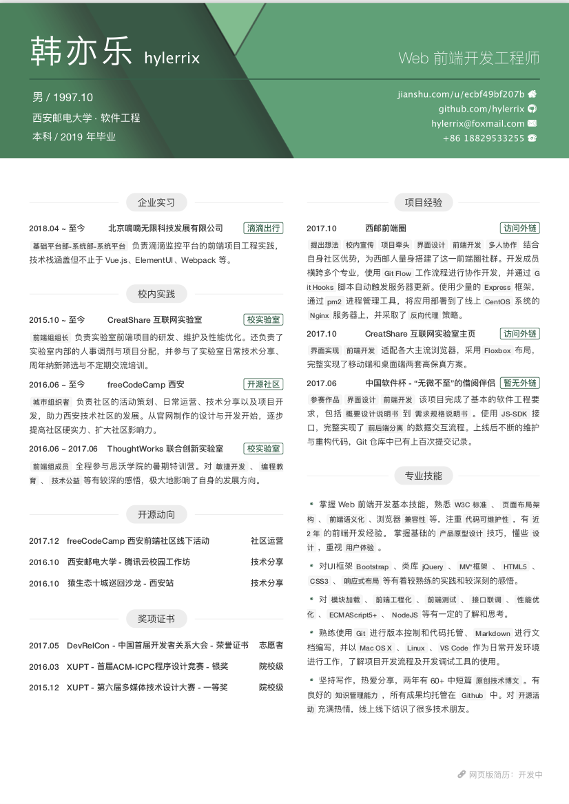

# hylerrix: 我的个人简历

网页版简历：开发完毕，等待部署，并分配域名

## hylerrix 的找实习路程

|时间|公司|状态|备注||
|-|-|-|-|-|
|2018-01-10|今日头条|投递简历|散招，投递简历给今日头条并通过筛选|
|2018-01-12|今日头条|约定时间|约在本月 18 号面试|
|2018-01-18|今日头条|技术一面|视频面试，未收到后续消息|
|2018-02-01|阿里巴巴-淘宝|投递简历|投递简历给淘宝技术团队架构组 leader，预计三月份内一面|
|2018-02-03|火币网|投递简历|HR 说，暑期实习需要过几个月再重投|
|2018-02-08|阿里巴巴-淘宝|网申简历|在阿里校园招聘网上填写|
|2018-02-24|阿里电话-淘宝|技术一面|电话面试半小时，未收到后续消息|
|2018-03-07|饿了么|投递简历|与内推学姐商量等自己将简历上大部分项目上线再进行正式投递|
|2018-03-07|滴滴出行|投递简历|投递至滴滴出行汽车资产管理中心员工邮箱账号，无后续消息|
|2018-03-07|tap4fun|投递简历|官网招聘入口投递 PDF 版简历，无后续消息|
|2018-03-07|拼多多|网申简历|官网招聘入口填写在线简历，只招 18 届应届，无后续消息|
|2018-03-07|梅沙科技|投递简历|简历由公司实验室毕业学长投递给 HR，等待面试消息|
|2018-03-08|梅沙科技|约定面试|与梅沙科技前端组长约定在 14 号面试|
|2018-03-14|百度|网申简历|填写在线简历，4.18 在线笔试。|
|2018-03-14|百度|投递简历|简历投递给实验室毕业学长进行内推，等待后续消息。|
|2018-03-14|梅沙科技|现场面试|一面二面 HR 面共计八十分钟，等待后续消息|
|2018-03-14|360-奇舞团|网申简历|在线简历填写完毕，等待 3.31 在线笔试，4 月中旬面试|
|2018-03-14|腾讯|投递简历|简历由西电学长帮内推，等待后续消息|
|2018-03-14|去哪儿|投递简历|简历由实验室毕业学姐帮内推，等待后续消息|
|2018-03-15|去哪儿|网申简历|内推简历通过筛选，完善在线简历，等待后续消息|
|2018-03-16|百度|网申简历|用学长内推成功的招聘账号重新填写在线简历，等待后续消息。|
|2018-03-16|梅沙科技|录用邀请|成功收割实习 Offer，深圳 150/天，等待协商|
|2018-03-16|腾讯|网申简历|在腾讯实习生招聘官网填写在线简历，届时 4.5-4.6 笔试|
|2018-03-16|腾讯-AlloyTeam|投递简历|投递简历给 AlloyTeam QQ 邮箱，等待后续消息|
|2018-03-16|今日头条|网申简历|招聘官网填写在线简历并投递成功，3.24 笔试、下旬面试|
|2018-03-16|京东|网申简历|招聘官网填写在线简历并投递成功，4.9 笔试，等待后续消息|
|2018-03-16|小米|网申简历|招聘官网填写在线简历并投递成功，4.10 笔试，等待后续消息|
|2018-03-16|网易|网申简历|hr.163.com 填写在线简历，没看到笔试时间，等待后续消息|
|2018-03-16|网易|网申简历|campus.163.com 填写在线简历，3.27 笔试，等待后续消息|
|2018-03-19|网易|网申简历|campus.163.com 填写在线简历，3.27 笔试，等待后续消息|
|2018-03-19|瓜子二手车直卖网|网申简历|等待线下面试时间邮件|
|2018-03-19|深信服|网申简历|填写 18 届应届生在线简历，估无后续消息|
|2018-03-19|美团点评|网申简历|填写在线简历，等待后续消息|
|2018-03-19|携程|网申简历|填写在线简历，等待后续消息|
|2018-03-20|滴滴出行|投递简历|未技术面直接收到 HR 电话，考虑是否在本学期内实习|
|2018-03-20|招商银行|网申简历|填写在线简历，等待后续消息|
|2018-03-20|瓜子车二手网|在线笔试|早上笔试，下午收到明早 9:00 西电北校区西大楼 208 面试，回复不确定去|
|2018-03-21|滴滴出行|录用邀请|收到 HR 电话，近两日发送 Offer 邮件，4.10 “悄悄”入职|
|2018-03-21|七牛云|网申简历|在线填写简历表单，选择 4.13 日 19:00 笔试|
|2018-03-20|瓜子车二手网|线下一面|因各种原因到场较晚，只有一面，据说要等二面电话|
|2018-03-22|滴滴出行|录用邀请|收到 Offer 邮件，明日办理招商银行卡|
|2018-03-22|美团点评|在线笔试|晚上进行在线笔试，实验室学弟助攻|
|2018-03-23|稀土掘金|网申简历|投递简历「FROM_JUEJIN_CONSOLE」|
|2018-03-23|有赞|网申简历|投递简历，“姓名-应聘XX职位-来自console”命名|
|2018-03-23|梅沙科技|收到电话|收到学长电话，以“教育+互联网、薪资”抛出橄榄枝，之后回复|
|2018-03-24|腾讯|约定时间|电话邀约在明日 25 号下午 15:00 面试|
|2018-03-25|腾讯|技术一面|历时一小时技术一面，答了很多前端基础问题，面试官在腾讯社交网络运营部|
|2018-03-25|滴滴出行|录用确认|各种心路历程后，办理招商银行卡，在线填写个人录用信息|
|2018-03-26|滴滴出行|入职准备|复印身份证、学生证、银行卡，打印一寸免冠照片、实习生邀请函，向负责人报道|
|2018-03-27|有赞|电话面试|突然打来的电话面试，半小时，只集中在 CSS 和 JS 并深入，不理想，之后几天邮件婉拒|
|2018-03-27|快手|面试邀请|学姐内推快手，但因最近以有 offer 且时间精力应放在巩固知识想复习而婉拒|
|2018-03-27|腾讯|技术二面|下午短信通知晚上 20:30 二面，晚上重点问了 node 和 nginx，不理想|
|2018-03-28|腾讯|打来电话|电话打来却没接上，官方电话回复不过去，发邮件问腾讯学长，说还会打来|
|2018-04-02|快手|面试邀请|快手内推电话再次打来，约定在 4.9 日下午 15:00 北京现场面试|
|2018-04-02|腾讯|面试邀请|电话打来又错失机会没接上...发邮件向学长询问情况，回复说接下来是大佬面试，不提前约定|
|2018-04-08|梅沙科技|遗憾没去|本计划好去深圳梅沙科技，最后又决定去北京滴滴，房已组好|
|2018-04-08|面试邀请|瓜子二手车直卖网|因自己就在北京，被邀请去中关村软件园现场参加二面|
|2018-04-09|技术面试|瓜子二手车直卖网||
|2018-04-09|技术面试|快手||
|2018-04-09|实习入职|滴滴出行||

> 饿了么、美图秀秀、天猫、喜马拉雅、唯品会、蘑菇街、58、同城、搜狐、西山居、唯品、爱奇艺、优酷、陌陌、微博等等等等
> ThoughtWorks、微软、谷歌、Facebook 等等等等

***一想到自己要实习，hylerrix 关注到了？***

* 个人所得税，企业交税
* 实习生待遇(房补餐补)，转正待遇
* 公司创新点，发展前景、发展故事
* 领导背景(CEO、CTO)
* 技术架构，前端架构
* 行业平均薪酬
* 职业发展，股票分成

> * 薪资什么时候发放
> * 房补餐补？住房建议？
> * 五一能否提现？

***这么“疯狂”找实习，hylerrix 的心态转变历程是？***

1. 毫无准备的面试，听毕业学长说“撑死胆大的”
2. 因准备不足和基础薄弱问题被早期大厂一面拒绝深感打击
3. 沉寂多天复习基础、刷面试题
4. 突然慌张地一次投递多个小公司准备练手
5. 逐渐找到面试自信，收割毕业学长所在的公司 Offer
6. 开始尝试投递各大互联网公司
7. 慌张不知如何回拒绝毕业学长公司的 Offer，重新思考 Offer 意义
8. 感悟到 offer 收多了可能尴尬，但一面二面还是得多挑战
9. 逐渐感悟到“你不试一下，就永远不会知道自己这次错过了什么。”
10. 抱着感悟海投各大公司，除了感悟面试经历，同时某种角度感悟互联网行业
11. 投递太多精力疲惫，很多笔试题也不答了，准备秋招选好若干最终公司好好准备

***hylerrix 给自己，同时给其他找实习同学的建议？***

* 真正的认识自己的性格，时刻自我反省自己能做什么、未来需要什么等
* 提前找好方向，确定想去的公司和想走的技术路线、大公司/创业公司等
* 大厂或者想去的公司忍住之后投，先面试别的公司攒经验
* 认识更多的人，人脉，内推不用愁，机遇不用愁
* 大学生的话，提前准备面试，而不是大三寒假完再说
* 电话面试时心态平和，诚恳切语速适度，不要抢话，多引导面试官问自己掌握的

***hylerrix 感悟到自己未来的路途？***

* 持续关注大前端领域
  * 包括但不限于浏览器、移动端、物联网、TV UI、AR/VR 等平台
  * 包括但不限于 SPA、PWA、Node.JS、Web 标准、混合开发、原生开发、桌面开发等技术方向
* 时刻关注互联网产品、互联网设计领域
  * 包括但不限于小程序、快应用、Material Design 等
* 时刻关注互联网技术潮流
  * 包括但不限于区块链、容器、微服务等
* 毕业两年达到阿里前端 P6 能力
* 毕业五年达到阿里前端 P8 能力
* 毕业五年足够拿到微软、苹果等外企 Offer

## hylerrix 的在线简历粘贴库

### 学生干部

|组织|职务|
|-|-|
|西安邮电大学 CreatShare 互联网实验室|前端组长|

### 获得奖励

|时间|赛事/活动|奖项|备注|
|-|-|-|-|
|2015.12|XUPT - 第六届多媒体技术设计大赛|一等奖|院校级|
|2016.03|XUPT - 首届 ACM-ICPC 程序设计竞赛|银奖|院校级|
|2017.05|DevRelCon - 中国首届开发者关系大会|荣誉证书|志愿者|

### 社会实践

|时间|社会实践|备注|
|-|-|-|
|2016.06|ThoughtWorks 暑期特训营|两个月|
|2016.09|freeCodeCamp 西安|多次组织线下活动并技术分享|
|2016.10|西安邮电大学腾讯云校园工作坊|技术分享|

### 项目经验

|开始时间|结束时间|项目名称|项目简述|项目职责|
|-|-|-|-|-|
|2015.12|2015.12|“励青春”文章分享平台|使用 PHP 框架 CodeIgnigter，能对 MySQL 数据库进行简单的增删该查，并部署至新浪云，通过参赛获得校级多媒体设计大赛一等奖。|PHP 开发|
|2016.07|2016.07|唯依蛋糕|为期两个月，学习使用 Node.JS、ReactJS、Webpack、MongoDB 构建该全栈项目，提供会员登录注册、蛋糕定制等功能，最终开源至 Github 中。后期持续对其进行代码重构、逻辑完善、页面美化。|Node 全栈开发|
|2017.05|2017.05|畅校园宣讲会|单个页面项目，调用后端提供的无限下拉接口，动态加载西安各大高校的近期宣讲会信息。|前端开发|
|2017.06|2017.06|无微不至的“借阅伴侣”|中国软件杯参赛作品。基于微信公众号，完整地实现了个人中心、借阅历史、书库搜书、我的收藏、搜索记录、图书详情等功能的前端设计、UI 开发与逻辑交互。同时完成了软件工程项目基本要求，包括概要设计说明书到需求规格说明书。Git 仓库中已有上百次提交记录。|前端开发|
|2017.08|2017.09|面向班级的代码作业管理系统|主动联系老师，结合 UI 组件库 SemanticUI ，使用了React 技术栈构建了这套面向班级进行作业提交、批改的单页 Web 应用系统。|前端开发|
|2017.10|至今|西邮前端圈|结合自身技术社区经历，为西邮人量身搭建了这一前端圈社群。开发成员横跨多个专业，使用 Git Flow 工作流程进行协作开发，并通过 Git Hooks 脚本自动触发服务器更新。使用少量的 Express 框架，通过 pm2 进程管理工具，将应用部署到了线上 CentOS 系统的 Nginx 服务器上，并采取了反向代理策略提供良好的域名访问体验。|全栈开发|
|2017.11|2017.11|CreatShare 实验室官网|适配各大主流浏览器，采用 flexbox 布局和 srcset 等 HTML5/CSS3 新技术，完整地实现了移动端和桌面端两套高保真方案。|前端开发|
|2017.12|2017.12|四六级成绩预测 H5|面向所有报考英语四六级考试的同学，推出了这款 H5 小游戏。响应式页面适配各大移动端浏览器，预测文本由纯前端生成，并基于 html2canvas 库将页面转换成图片进行朋友圈分享。|前端开发|
|2018.03|至今|freeCodeCamp 小程序|正在开发|全栈开发|

## hylerrix 的个人介绍

### 自我评价

> 爱好编程，性格开朗，热情积极，有担当，喜欢看书看电影。关注行业动态，遇到技术困难喜欢寻根究底。

### 请介绍一项你最热爱、最擅长的专业领域，并且介绍你在这个领域的学习经历和未来的学习规划。

> 热爱互联网，目前专注在 Web 前端领域的发展。

### 学习经历(参考 “项目经验” 和如下实验室/社区经历)

> 1. 2015 年至今，加入校内 CreatShare 互联网实验室，并在接下来的几年内参与开发了众多中小型前端项目，如实验室官网、H5 活动页面、城市校园宣讲会查询页面等。实战理解了响应式开发、前后端分离、团队协作等众多在 Web 开发中常遇的理念。
> 2. 2016 年，大一暑假，全程参加了 ThoughtWorks 暑期特训营。在为期两个月的特训学习中，实战了 Node.JS、ReactJS、Webpack 等众多曾经的前端知识盲点，并结合前端工程化思想，在最后两周的项目阶段和小组成员，开发出了一款基于 ReactJS + ExpressJS + MongoDB 的小型 Web “全栈”应用。
> 3. 2016 年至今，正值 freeCodeCamp 开源项目的快速发展，结交了很多推进其本土化的开源业界人士。现今承担着 freeCodeCamp 西安社区组织者的职责，多次推动线下前端学者交流、分享活动，并持续为该社区进行开源贡献。

### 学习规划

> 1. 逐步探索各大终端端前界面实现的技术原理，如 TV UI、物联网设备 UI、Watch UI 等；
> 2. 持续学习 Web 开发知识，跟进探索技术领域新动态，如 Dark、Go、Docker、PWA 等；
> 3. 关注业务，拥抱变化，深入了解各大主流编程语言及其应用场景；
> 4. 持续学习，刻意练习，对一切技术挑战报之以极大的热情与信心去克服它；
> 5. 为开源线上/线下社区持续贡献自己的力量，如社区分享、翻译文档、书籍写作等。

### 请介绍你参与的印象最深刻的一个项目，为什么？并且介绍你在项目中的角色和发挥的作用。

> 印象深刻的是大一暑假，参加 ThoughtWorks 举办的暑期特训营时和学长学姐们一起写的 Web 应用。我在其中扮演的是技术开发的职责，同时负责前端 UI 和后端逻辑的实现。
在这个为期两周的项目中，结合前端工程化思想，实战了 ReactJS + Webpack + ExpressJS + MongoDB 等众多技术，第一次编写组件化 UI 界面，对之后编写前端项目有深远的影响。同时这种前后端都用 JavaScript 来实现的方式也导致自己之后持续探索 NodeJS 领域，使自己不局限于简单的界面实现工作。

### 你最期望在阿里巴巴工作（或实习）的部门或项目是什么？请介绍下你对该部门的了解和希望加入的原因。

> 1. 内推我的是淘宝终端技术团队的前辈，如果能去淘宝终端技术团队那就更好了；
2. 需要前端应届生的技术团队都可以的，首选城市希望在北京、广州或深圳，但不设限。

## hylerrix 遇到的面试题

### 阿里淘宝春招实习一面 - 2018.02.24

* 为什么学前端
* 对前端的看法
* HTML5 新特性
* flex 布局
* this 指针
* CSS 优先级
* position 属性值 display 属性值
* localStorage、sessionStorage、cookie 区别
* 闭包 
* 快速排序思想 
* 你有哪些项目经历

### 今日头条散招一面 - 2018.01.18

* 三个代码解析题
* get post 区别
* HTTP 缓存
* 同源策略

### 梅沙科技一二终极面 - 2018.03.14

* 现场面试，没有记住太多，较为顺利

## hylerrix 的 PDF 版简历

[点我查看](./resume.pdf)

## hylerrix 的 PNG 版简历

## 简历库使用方式

- 0、`yarn add` 或 `cnpm install` 安装依赖
- 1、编辑 `/src/index.html` 文件
- 2、命令行运行 `yarn run rebuild`
- 3、打开 `/index.html` 进行预览

> chrome 浏览器 - "打印" - 设置无边距 - 即可导出

## 简历库参考借鉴来源

- [简历 | 闵聪 - Cong Min](http://resume.congm.in/)
- [简历 | 琚致远 - Shaoyao·琚](https://up.shaoyaoju.org/)

> Fork 或借鉴请注明出处： [@Cong Min](https://congm.in)
